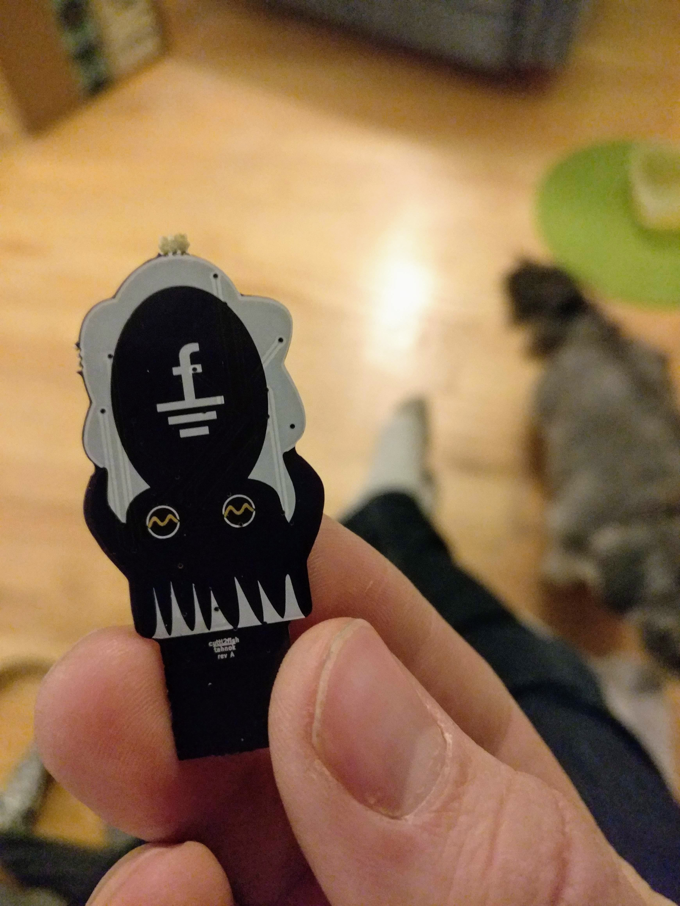
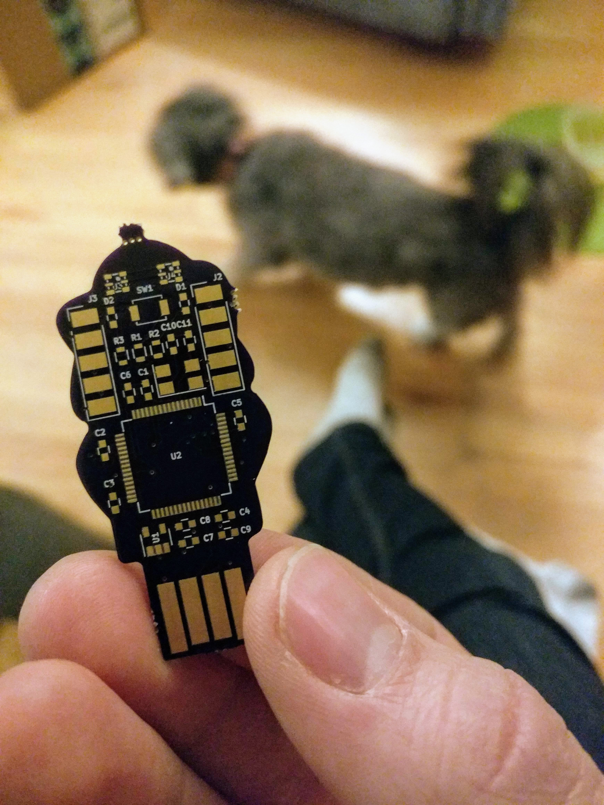
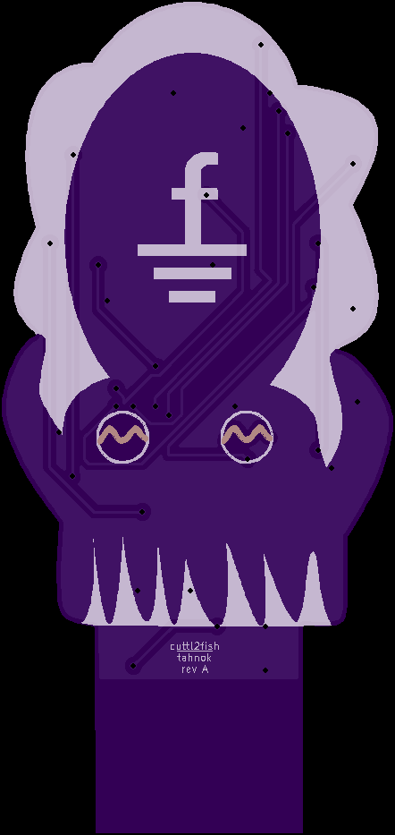
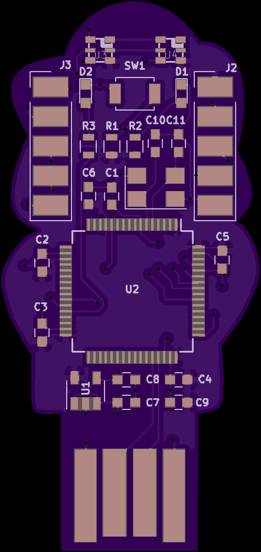

# Cuttle2Fish

Something you know (password) and something you have (cuttlefish shaped U2F token)

Based on the STM32F103

## Software

Intended to be based on https://github.com/gl-sergei/u2f-token

## Design Notes

https://github.com/tahnok/wiki/wiki/cuttle2fish

## Pictures

